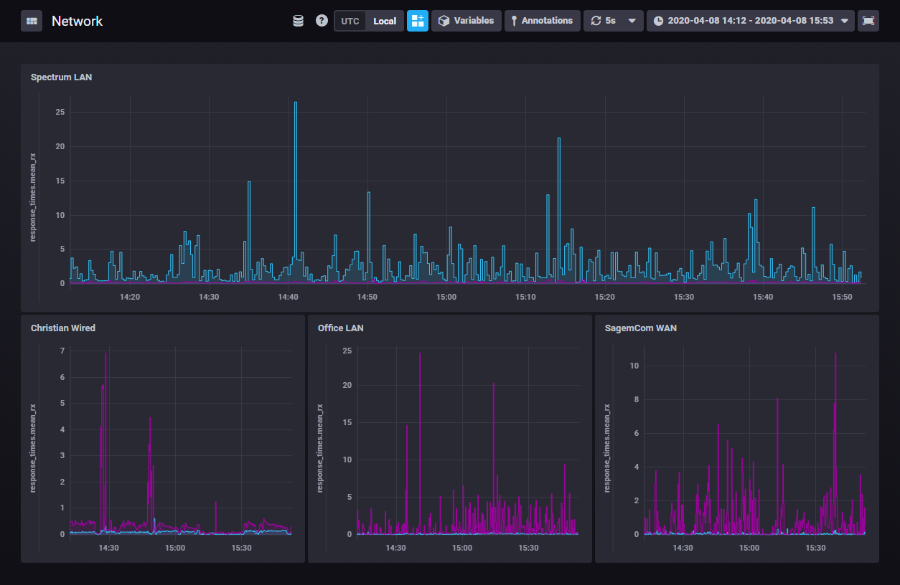

# GS108PEv3 Graphing Utility for InfluxDB with NodeJS

This switch doesn't have snmp or anything so I had to do some
dirty workarounds to get some graphs going that satisfy my needs

## Example graph with Chronograf


## Installation and Prerequisits

You must have InfluxDB and Node.JS

Rename config.js_template to config.js and modify the values for your configuration
Get your auth cookie from the admin interface with dev tools
I currently do not feel like implementing password auth lol

```yarn install / npm install```

```node index.js```

or use your preferred process manager like pm2